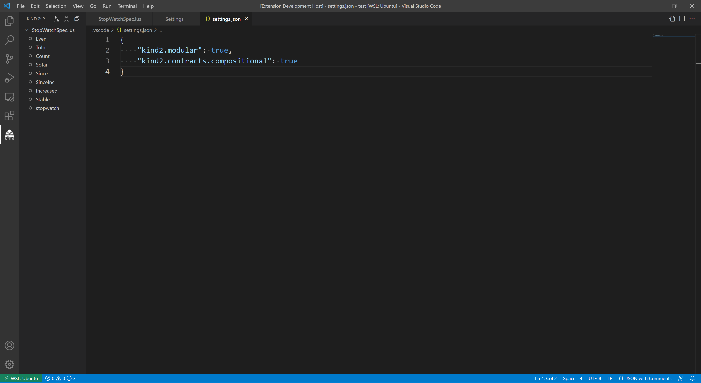

# Kind 2 Extension for VS Code
This extension provides basic support for the Lustre programming language with [Kind 2 Model Checker](https://kind2-mc.github.io/kind2) annotations.

## Requirements
### Linux and MacOS
* Java 11+ run-time.
  * Debian-based Linux: `sudo apt install openjdk-17-jdk`
  * RHEL-based Linux: `sudo yum install java-17-openjdk`
  * MacOS: `brew install --cask temurin`
* (Optional) ZeroMQ messaging library.
  * Debian-based Linux: `sudo apt install libzmq3-dev`
  * RHEL-based Linux: `sudo yum install libzmq3-devel`
  * MacOS: `brew install zmq`

  The `kind2` executable bundled with this extension is _statically_ linked against the ZeroMQ messaging library and does not require it to be installed in the system. Manually built `kind2` executables are dynamically linked by default and *do* require the library to be installed in the system.

***Note:*** This extension only works with versions 1.5.1 and above of `kind2`.

### Windows (Advanced)
Windows is only supported through [WSL2](https://docs.microsoft.com/en-us/windows/wsl/about) (Windows 10 version 1903+ or Windows 11). WSL1 is not supported. Follow these steps to run the extension on WSL2:
1. Install WSL
    * Windows 10 version 2004+ and Windows 11: Run `wsl --install` in PowerShell or Windows Command Prompt and restart your machine.
    * Windows 10 version 1903+: follow the manual steps in [this page](https://docs.microsoft.com/en-us/windows/wsl/install).
2. Follow the instructions on [this page](https://docs.microsoft.com/en-us/windows/wsl/setup/environment#set-up-your-linux-user-info) to finish setting up your WSL2 Linux environment.
3. Install the [Remote - WSL](https://marketplace.visualstudio.com/items?itemName=ms-vscode-remote.remote-wsl) extension for VS Code.
4. Click on the green rectangle in the bottom-left corner of the VS Code window. A prompt will appear on the top. click on `new WSL window`.

5. Press `` Ctrl+Shift+` `` to open a Linux terminal on the new VS Code window. Use the terminal to install the Java run-time and the ZeroMQ messaging library (follow the instructions in the above section for your Linux distribution).
6. In the same VS Code window, go to the extension view in the activity bar to the left and lookup the `Kind 2` extension. Click `Install in WSL: <distro name>`.

Refer to [this page](https://docs.microsoft.com/en-us/windows/wsl/tutorials/wsl-vscode) to learn more about using WSL with VS Code.

## Options
The extension supports modular and compositional analysis modes of Kind 2. Those modes are disabled by default. Follow the steps below to enable them (and other Kind 2 configurations):
1. Go to VS Code settings.
  
2. Click on Kind 2 under the Extensions section.
  
3. Enable modular, compositional, and/or other options.
  
4. If you prefer an editor interface, click on _ icon at the top-right corner of the settings page to switch the JSON view:
  
5. Type `kind2`. VS Code will provide an autocompletion menu with available Kind 2 options. Select the options you want to configure and save your changes.
  

You can also enable/disable modular and compositional analysis modes from Kind's view. Click on their icons to enable them.

## Main Features
* Syntax highlighting for Lustre and Kind 2 constructs.
* Document symbol outline.
  
* Syntax and type error reports.
  
* Model checking.
  
* Simulations.
  
* Counter-examples for falsified properties.
  
* Raw output of calling Kind 2 through the terminal.
  
